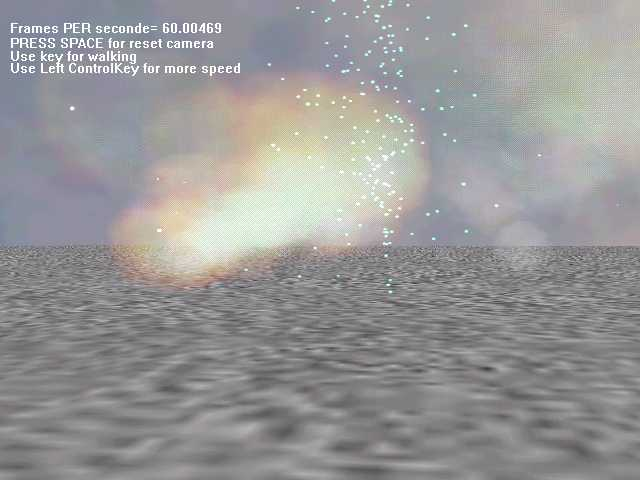



## Johna 3d engine 1\.02 Particle effect DEMO

### Description

This is a particle FX demo

made with my 3d engine made with directX7 for VB

But i cannot put the Dll engine on PSC

for downloading the full Zip demo

Go to www.multimania.com/johnapop

by now i have to rewrite my source code and

check my variable name written in french language

but i'll put the source code as soon as i'll correct all my code.

For people who are interrested in getting the source code or portion of source code of my engine

write me...

The website of the project is wwww.multimania.com/johnapop.
 
### More Info
 

             |
---                |---
**Submitted On**   |2001-10-28 20:23:08
**By**             |[polaris](https://github.com/Planet-Source-Code/PSCIndex/blob/master/ByAuthor/polaris.md)
**Level**          |Advanced
**User Rating**    |4.7 (14 globes from 3 users)
**Compatibility**  |VB 4\.0 \(32\-bit\), VB 5\.0, VB 6\.0
**Category**       |[Graphics](https://github.com/Planet-Source-Code/PSCIndex/blob/master/ByCategory/graphics__1-46.md)
**World**          |[Visual Basic](https://github.com/Planet-Source-Code/PSCIndex/blob/master/ByWorld/visual-basic.md)
**Archive File**   |[Johna 3d e3160810282001\.zip](https://github.com/Planet-Source-Code/polaris-johna-3d-engine-1-02-particle-effect-demo__1-28478/archive/master.zip)

